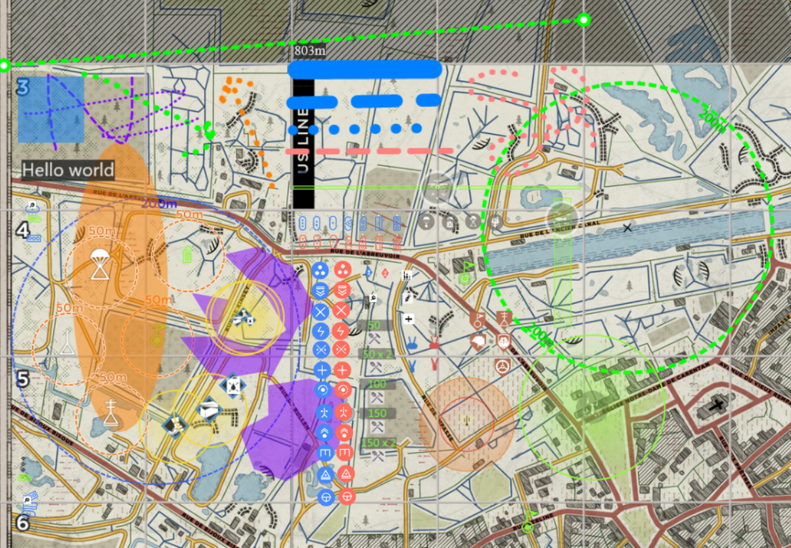

# 人间地狱地图战术分析

## 快速为Hell Let Loose创建高级自定义战术地图。

- https://mattw.io/maps-let-loose/

##  如何使用这个工具？

- 规划驻军位置，显示200米半径范围
- 查看攻势模式默认驻军位置，了解攻击目标
- 查看最大炮兵射程以及可以/不能攻击的最后据点
- 测量反坦克狙击距离
- 创建房间与团队实时编辑战术地图
- 使用各种资源为即将到来的比赛和场景制定策略
    - 驻军、前哨、空降点、半履带车、坦克、卡车、反坦克炮、标记、玩家职业、维修站、节点、补给、指挥官技能、测量工具、形状、文本框和绘图

## 还有哪些其他功能？

- 切换所有据点及其资源图标的显示/隐藏
- 切换地图网格的显示/隐藏
- 切换坦克和玩家职业的蓝色和红色以表示友军/敌军
- 将地图保存为高质量的1920x1920 PNG图片
- 将当前地图配置导出为zip文件，稍后重新导入继续编辑
- 在地图上自由绘制任何颜色
- 缩小时某些较小元素会放大显示
- 基本支持移动设备，即使没有第二个显示器也能使用
- 房间可以配置自定义密码或无密码
- 房间在2小时无活动后过期，足够大多数比赛使用

## 构建

参考 [BUILD.md](./BUILD.md)
了解如何从源代码构建和运行的说明。

## 贡献

欢迎贡献代码，请参考
[CONTRIBUTING.md](./CONTRIBUTING.md)
了解更多详情。
